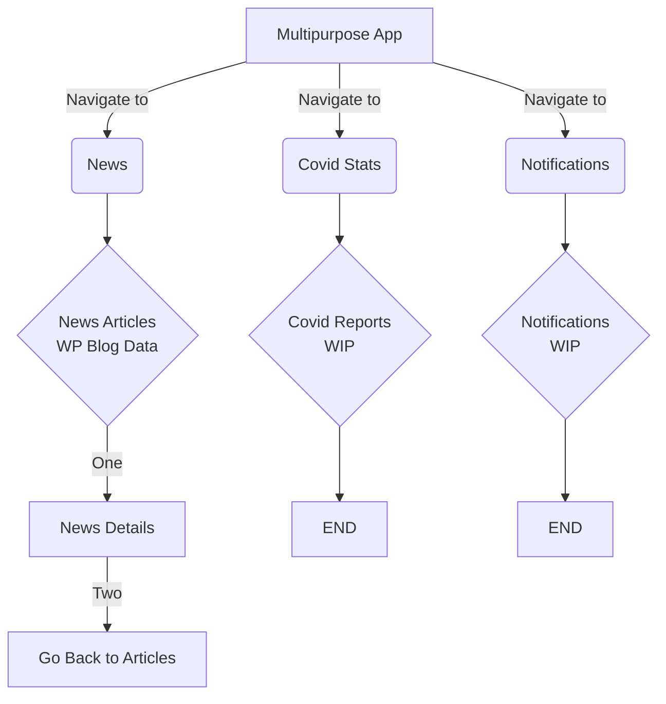

## Application Flow

```mermaid
flowchart TD
    A[Multipurpose App] -->|Navigate to | B(News)
    A[Multipurpose App] -->|Navigate to | C(Covid Stats)
    A[Multipurpose App] -->|Navigate to | I(Notifications)
    B --> D{News Articles \n WP Blog Data}
    D -->|One| E[News Details]
    E -->|Two| F[Go Back to Articles]
    C --> G{Covid Reports \n WIP}
    G --> H[END]
    I --> J{Notifications \n WIP}
    J --> L[END]
```
